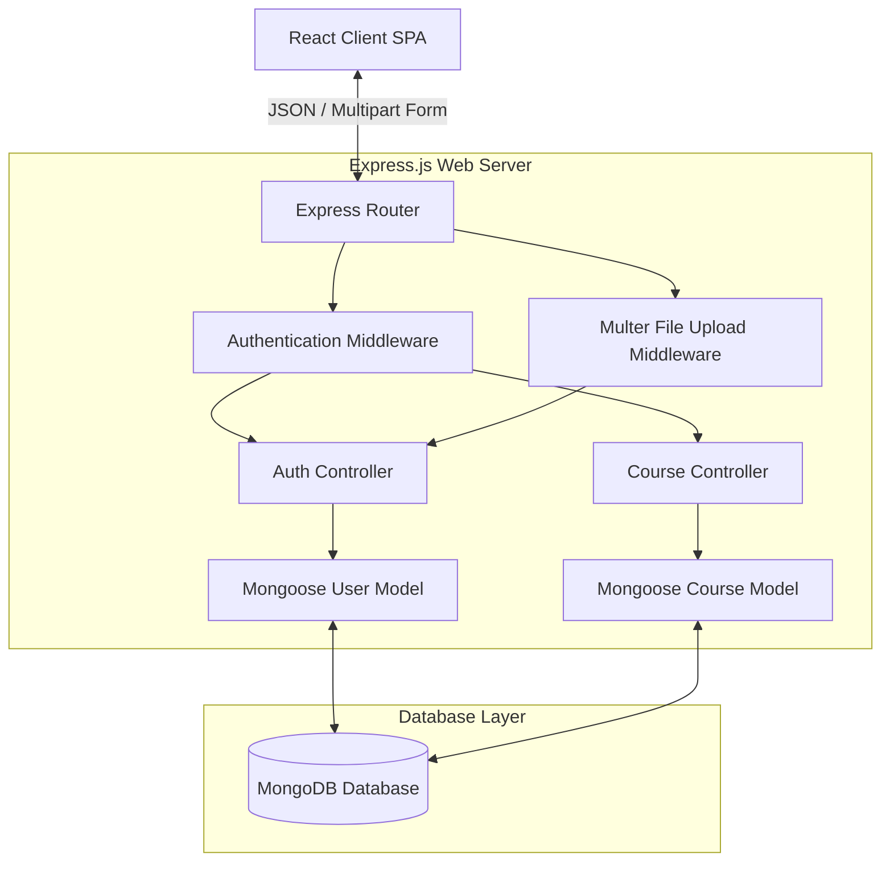
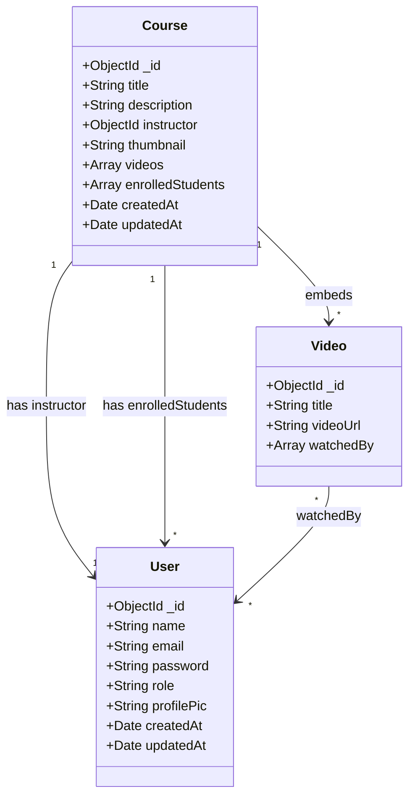
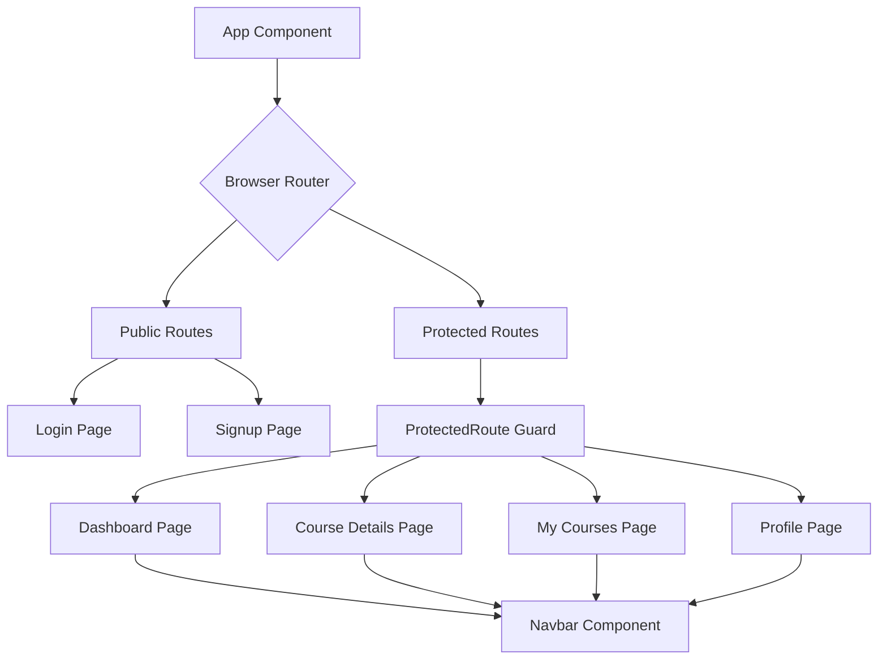

<style>
  @import url('https://fonts.googleapis.com/css2?family=Inter:wght@300;400;500;600;700&family=JetBrains+Mono:wght@400;500;600&display=swap');
  
  /* Reset and base styles */
  .markdown-body, body {
    font-family: 'Inter', -apple-system, BlinkMacSystemFont, "Segoe UI", Helvetica, Arial, sans-serif !important;
    line-height: 1.6;
    color: #2c3e50;
    max-width: 900px;
    margin: 0 auto;
    padding: 2rem;
  }
  
  /* Headings with distinct color and clean weight */
  h1, h2, h3, h4, h5, h6 {
    font-family: 'Inter', sans-serif !important;
    color: #1e293b;
    font-weight: 700;
    margin-top: 1.8em;
    margin-bottom: 0.6em;
    border-bottom: none;
  }
  
  h1 {
    font-size: 2.25rem;
    color: #0f172a;
    border-bottom: 2px solid #e2e8f0;
    padding-bottom: 0.3em;
  }
  
  h2 {
    font-size: 1.65rem;
    color: #1e293b;
    border-bottom: 1px solid #f1f5f9;
    padding-bottom: 0.2em;
  }
  
  h3 {
    font-size: 1.3rem;
  }
  
  /* Tables with premium borders and typography */
  table {
    border-collapse: collapse;
    width: 100%;
    margin: 1.5em 0;
    font-size: 0.95rem;
  }
  
  table th, table td {
    border: 1px solid #e2e8f0;
    padding: 10px 14px;
    text-align: left;
  }
  
  table th {
    background-color: #f8fafc;
    color: #334155;
    font-weight: 600;
  }
  
  table tr:nth-child(even) {
    background-color: #f8fafc;
  }

  /* Code block formatting */
  code, pre, tt {
    font-family: 'JetBrains Mono', "SFMono-Regular", Consolas, Menlo, monospace !important;
    font-size: 0.88em !important;
    background-color: #f1f5f9;
    color: #0f172a;
    border-radius: 4px;
    padding: 0.2em 0.4em;
  }
  
  pre {
    background-color: #0f172a;
    padding: 1rem;
    border-radius: 8px;
    overflow-x: auto;
    border: 1px solid #1e293b;
  }
  
  pre code {
    background-color: transparent !important;
    color: #f8fafc !important;
    padding: 0;
  }

  /* Blockquote callout styling */
  blockquote {
    border-left: 4px solid #3b82f6;
    background-color: #eff6ff;
    padding: 10px 20px;
    margin: 1.5em 0;
    color: #1e3a8a;
  }
</style>

# Edumentr — Premium eLearning Platform
## Comprehensive Technical Design & Implementation Report

**Project Title:** Edumentr — Full-Stack Udemy Clone  
**Architecture:** MERN (MongoDB, Express.js, React, Node.js)  
**Created By:** Software Engineering Development Team  
**Date:** May 31, 2026  
**Version:** 1.0.0  

---

### Abstract
This technical report details the architecture, database design, backend services, API interfaces, frontend components, workflows, security, and local setup of the **Edumentr** application. This system is a premium, multi-tenant learning environment providing distinct course management workflows for Instructors (Teachers) and learning/tracking experiences for Students. Built upon a modern decoupled MERN stack, the application enforces strong data relational integrity through Mongoose, robust stateless authentication using JSON Web Tokens (JWT), resilient asynchronous multipart media storage via Multer, and a responsive frontend client powered by React. 

<div style="page-break-after: always;"></div>

## Table of Contents

1. [Executive Summary & Project Objectives](#1-executive-summary--project-objectives)
2. [Functional & Non-Functional Requirements Analysis](#2-functional--non-functional-requirements-analysis)
3. [System Architecture & Core Technology Stack](#3-system-architecture--core-technology-stack)
4. [Mongoose Data Models & Database Schema Design](#4-mongoose-data-models--database-schema-design)
5. [RESTful API Endpoints & Controller Interface Specification](#5-restful-api-endpoints--controller-interface-specification)
6. [Security Architecture & Custom Express Middlewares](#6-security-architecture--custom-express-middlewares)
7. [Frontend Architecture & React Component Hierarchy](#7-frontend-architecture--react-component-hierarchy)
8. [Core Workflows & Key Code Snippets](#8-core-workflows--key-code-snippets)
9. [Local Environment Configuration & Deployment Guide](#9-local-environment-configuration--deployment-guide)
10. [Future Scope, Verification Plan & Conclusions](#10-future-scope-verification-plan--conclusions)

---

<div style="page-break-after: always;"></div>

## 1. Executive Summary & Project Objectives

The rapid digitization of academic and corporate educational ecosystems has heightened the demand for scalable, interactive, and reliable virtual learning spaces. This project, entitled **Edumentr**, represents a modern Web application engineered to bridge the operational gap between educators and learners. By delivering a streamlined, lightweight, yet powerful digital classroom, the platform facilitates administrative and pedagogical efficiency.

### Core System Goals
The fundamental objective of this system is to consolidate the essential elements of classroom management into a single, cohesive interface:
* **Role-Based Access Control (RBAC):** Implementing custom, secure experiences based on whether a authenticated user is registered as a `student` or a `teacher`.
* **Course Lifecycle Management:** Permitting instructors to design, build, upload thumbnails for, update, and manage complete academic courses.
* **Content Delivery and Tracking:** Offering an interactive medium where students can enroll in courses, view lectures, and track individual progress dynamically by marking video lectures as "watched".
* **Profile Management:** Letting users self-manage their profiles, including uploading profile pictures that persist on a local cloud storage asset engine.

### Key Architectural Standards
1. **Decououpled Communication:** Separation of the client interfaces and API endpoint layers to ensure horizontal scalability.
2. **Stateless Security:** Utilization of cryptographic token exchange (JWT) for user sessions rather than database-dependent session storage.
3. **Data Relational Integrity:** Enforcing schema rules on document-based MongoDB instances via strict object validation.

---

<div style="page-break-after: always;"></div>

## 2. Functional & Non-Functional Requirements Analysis

To engineer a system capable of real-world application, we establish concrete constraints across two primary criteria: what the application does (Functional), and how it performs under physical constraints (Non-Functional).

### Functional Requirements

#### A. Guest / Anonymous User Operations
* **Sign Up:** Create a unique user profile specifying `name`, `email`, `password`, and selecting a specific role (`student` or `teacher`).
* **Log In:** Authenticate credentials against secure databases and acquire a cryptographically signed identity web token.

#### B. Student-Specific Operations
* **Global Course Catalog Browser:** View all available courses on the platform, showing title, description, instructor profile, and thumbnail.
* **Course Enrollment:** Dynamically register for any course with a single action, which registers the student profile into the course's roster.
* **Interactive Learning Panel:** View registered course materials, play attached video lectures, and toggle a "mark as watched" parameter to update lesson completion state.
* **Academic Dashboards:** View a customized student overview dashboard indicating all currently enrolled courses.
* **Unenroll Option:** Terminate a course enrollment status and withdraw the profile from the course's active roster list.

#### C. Instructor (Teacher) Specific Operations
* **Course Creator Portal:** Create new courses by inputting titles, descriptions, and designating thumbnails.
* **Curriculum Management:** Add or delete video lectures within individual courses owned by that specific instructor.
* **Instructor Dashboards:** View a listing of all academic courses designed by the instructor and see structural rosters.
* **Course Deletion:** Securely remove courses from the global listing.

---

### Non-Functional Requirements

| Metric Category | Target Standard | Mitigation Strategy |
| :--- | :--- | :--- |
| **Response Latency** | API endpoints resolve in < 250ms under peak loads. | Mongoose indexing on core lookups (e.g. unique index on User `email`). |
| **Data Integrity** | Cascade exclusions and model-level schema checks. | Middleware data validation checks prior to triggering write states in Mongo. |
| **Security Protocols** | Industry-standard password hashing and strict RBAC. | Bcrypt hashing on signup and JWT token authorization headers on all API requests. |
| **Media Resiliency** | Zero-downtime static image resource resolving. | Express static route mapping to locally stored upload disk directories. |
| **Visual Responsiveness** | Fully liquid, multi-device UI compatibility. | Built using customized modern CSS and responsive layouts that adjust from mobile to ultra-wide. |

---

<div style="page-break-after: always;"></div>

## 3. System Architecture & Core Technology Stack

The application employs a MERN architecture pattern, which separates the user-interface rendering layer from the business logic layer. The front-end React client communicates with the back-end Node.js application via asynchronous RESTful HTTP requests.



### Technology Selection Justification

* **MongoDB:** A document-oriented Database choice matching JavaScript's object schema natively. Its schemaless nature is governed strictly in our software layers by Mongoose schema declarations.
* **Express.js:** A minimalist server framework for Node.js. It facilitates robust router management and allows granular middleware nesting (e.g., locking course creation pages behind an active JWT session).
* **React.js:** A declarative library utilizing virtual DOM structures to deliver high-performance SPA (Single Page Application) flows. Perfect for reactive UI components like marking videos watched in real-time.
* **JWT (JSON Web Tokens):** Enables stateless session handling. This is critical for scaling backend microservices, as the server does not need to query a session table to authenticate subsequent requests.
* **Bcrypt.js:** Utilizes a custom, computationally intensive hashing algorithm to secure passwords before storage, protecting them from brute-force lookup attacks.
* **Multer:** An Express middleware module optimized for parsing `multipart/form-data`. This allows the server to efficiently handle media uploads (like profile pictures) and store them directly on server storage directories.

---

<div style="page-break-after: always;"></div>

## 4. Mongoose Data Models & Database Schema Design

The Edumentr database consists of two core Mongoose schemas: `User` and `Course`. Although MongoDB is non-relational, our schemas simulate structural integrity using document referencing (`ObjectId`).

### 1. User Schema (User.js)
Stores critical authentication credentials, contact identities, role permissions, and custom static profile assets.

* **Database Collection Name:** `users`
* **Key Constraint:** Strict uniqueness on the `email` index.
* **Role Options:** Enforced enumeration array (`student`, `teacher`, `admin`).

```javascript
// Field Representation Table
{
  name: { type: String, required: true },
  email: { type: String, required: true, unique: true },
  password: { type: String, required: true },
  role: { type: String, enum: ["student", "teacher", "admin"], default: "student" },
  profilePic: { type: String, default: "" }
}
```

---

### 2. Course Schema (Course.js)
Handles the metadata of learning curriculum, sub-embedded video array lists, and references to student rosters.

* **Database Collection Name:** `courses`
* **References:** Relates `instructor` to the `User` collection.
* **Embedded Array Schema:** `videos` is modeled as a nested array structure inside the course document containing trackable `watchedBy` lists.



---

#### Detailed Field Mapping: Course Model

| Field Name | Data Type | Requirement Rules | Description |
| :--- | :--- | :--- | :--- |
| `title` | `String` | Required | The structural title of the course. |
| `description` | `String` | Required | Comprehensive textual overview of the course. |
| `instructor` | `ObjectId` | Ref: `User` | Maps the course to its author/teacher. |
| `thumbnail` | `String` | Optional | Static asset URL pointing to the course cover image. |
| `videos` | `Array` | Sub-Document | A collection of lectures. Each index contains a `title`, a `videoUrl`, and a `watchedBy` array of student `ObjectId`s. |
| `enrolledStudents`| `Array` | Ref: `[User]` | Roster of student IDs registered in this course. |

---

<div style="page-break-after: always;"></div>

## 5. RESTful API Endpoints & Controller Interface Specification

Communication between our frontend client and backend Express server is defined by standard HTTP methods.

### Authentication Service Endpoints (`/api/auth`)

#### 1. POST `/api/auth/signup`
Creates a brand-new user document in the database.
* **Payload Format:** JSON
* **Request Schema:**
  ```json
  {
    "name": "Jane Doe",
    "email": "jane@edumentr.com",
    "password": "SecurePassword123",
    "role": "teacher"
  }
  ```
* **Success Response (201 Created):**
  ```json
  {
    "message": "User registered successfully",
    "token": "eyJhbGciOiJIUzI1NiIsInR5cCI6IkpXVCJ9...",
    "user": { "_id": "603d...", "name": "Jane Doe", "email": "jane@edumentr.com", "role": "teacher" }
  }
  ```
* **Error Response (400 Bad Request):** Returns `{"message": "User already exists"}` if email is registered.

#### 2. POST `/api/auth/login`
Validates user credentials and signs a new authorization session JWT token.
* **Payload Format:** JSON
* **Request Schema:**
  ```json
  {
    "email": "jane@edumentr.com",
    "password": "SecurePassword123"
  }
  ```
* **Success Response (200 OK):**
  ```json
  {
    "message": "Login successful",
    "token": "eyJhbGciOiJIUzI1NiIsInR5cCI6IkpXVCJ9...",
    "user": { "_id": "603d...", "name": "Jane Doe", "role": "teacher" }
  }
  ```

#### 3. PUT `/api/auth/profile`
Updates the authenticated user's profile information. Handles profile picture uploads using `multipart/form-data`.
* **Headers:** `Authorization: <JWT_Token>`
* **Success Response (200 OK):**
  ```json
  {
    "message": "Profile updated",
    "user": { "_id": "603d...", "name": "Jane Doe", "profilePic": "http://localhost:5000/uploads/1622...-profile.jpg" }
  }
  ```

---

<div style="page-break-after: always;"></div>

### Course Service Endpoints (`/api/courses`)

All course creation, management, deletion, and video tracking endpoints are defined below.

| Route Endpoint | HTTP Method | Auth Required | User Role Restriction | Endpoint Functional Behavior |
| :--- | :--- | :--- | :--- | :--- |
| `/api/courses/` | `GET` | No | Any | Fetches all courses, populating instructor fields. |
| `/api/courses/:id` | `GET` | No | Any | Retrieves detailed course metadata by ID. |
| `/api/courses/create` | `POST` | Yes | `teacher` | Creates a new course. Sets current user as instructor. |
| `/api/courses/enroll/:id`| `POST` | Yes | `student` | Adds the student ID to the course's enrollment array. |
| `/api/courses/unenroll/:id`| `POST` | Yes | `student` | Removes the student ID from the enrollment array. |
| `/api/courses/my/enrolled`| `GET` | Yes | Student or Teacher | Fetches courses enrolled by a student, or owned by a teacher. |
| `/api/courses/video/:id` | `POST` | Yes | `teacher` | Adds a new video object to the course's videos array. |
| `/api/courses/watch/:courseId/:videoId` | `POST` | Yes | `student` | Marks a video as watched by adding user ID to `watchedBy`. |
| `/api/courses/video/:courseId/:videoId` | `DELETE`| Yes | `teacher` | Removes a specific video object from the course's videos array. |
| `/api/courses/:id` | `DELETE`| Yes | `teacher` | Deletes a course. The instructor must own the course. |

---

#### Critical Course Endpoint Payload Schemas

##### Add Video to Course: `POST /api/courses/video/:id`
* **Headers:** `Authorization: <JWT_Token>`
* **Request Schema:**
  ```json
  {
    "title": "Introduction to Database Systems",
    "videoUrl": "https://www.w3schools.com/html/mov_bbb.mp4"
  }
  ```
* **Success Response (200 OK):**
  ```json
  {
    "message": "Video added successfully",
    "course": {
      "_id": "604e...",
      "title": "MERN Stack Crash Course",
      "videos": [
        {
          "_id": "604f...",
          "title": "Introduction to Database Systems",
          "videoUrl": "https://www.w3schools.com/html/mov_bbb.mp4",
          "watchedBy": []
        }
      ]
    }
  }
  ```

---

<div style="page-break-after: always;"></div>

## 6. Security Architecture & Custom Express Middlewares

System security is designed around a zero-trust model. The backend APIs protect secure databases by routing requests through customizable, context-aware functional middlewares.

### 1. Authentication and Authorization Guard (`authMiddleware.js`)
This middleware acts as a security checkpoint for our routes. It extracts the security token from the request header, decrypts it using our server secret, and attaches the payload back to the request context.

```javascript
// Middleware Source Code Analysis
const jwt = require("jsonwebtoken");

const authMiddleware = (req, res, next) => {
  try {
    const token = req.headers.authorization;

    if (!token) {
      return res.status(401).json({
        message: "No token provided",
      });
    }

    // Verify token validity
    const decoded = jwt.verify(token, process.env.JWT_SECRET);
    req.user = decoded; // Sets decrypted user context (userId, role)
    next();
  } catch (error) {
    return res.status(401).json({
      message: "Invalid token",
    });
  }
};
```

---

### 2. Multi-Part Binary Media File Upload Engine (`upload.js`)
To securely accept file uploads (like avatar profile pictures) without locking threads, we configure a disk storage engine using `Multer`. 

* **Directory Target:** Writes directly to root `./uploads/` storage.
* **Filename Sanitization:** Combines a high-precision epoch timestamp (`Date.now()`) with the original filename to prevent namespace collisions.

```javascript
const multer = require("multer");

const storage = multer.diskStorage({
  destination: function (req, file, cb) {
    cb(null, "uploads/");
  },
  filename: function (req, file, cb) {
    cb(null, Date.now() + "-" + file.originalname);
  },
});

const upload = multer({ storage });
```

---

<div style="page-break-after: always;"></div>

## 7. Frontend Architecture & React Component Hierarchy

The frontend is built as a single-page React application, featuring dynamic client-side routing, protected route guards, and a responsive custom CSS system.

### Page and Route Layout Routing Configuration
The client-side page layout routes are registered inside `App.js` with structural path configurations.

```
/
├── login (Public Page - Authenticates session)
├── signup (Public Page - Creates user profile)
└── [Protected Routes] (Enclosed within <ProtectedRoute> guard)
    ├── /dashboard (Loads customized student or teacher control panels)
    ├── /course/:id (Loads complete video syllabus, course player & tracker)
    ├── /my-courses (Loads personalized lists of enrolled/authored courses)
    └── /profile (Allows editing and updating avatar pictures)
```



### Component Structure Walkthrough

1. **`Navbar.js`:** Considers active global authorization sessions. Displays core navigation, user roles, name, and profile pictures. Includes a logout handler that clears local storage.
2. **`ProtectedRoute.js`:** Validates client-side authentication tokens. If no token is detected, it redirects the browser to `/login` to protect secure routes.
3. **`Dashboard.js`:** The central hub of the Edumentr catalog.
   * **For Students:** Lists all globally available courses on the platform, allowing search, selection, and enrollment.
   * **For Teachers:** Displays a "Create Course" panel and lists all courses they have designed.
4. **`CourseDetails.js`:** The primary workspace. Students can watch videos and mark them as completed. Teachers can add new lessons (video title/URL) or delete the course.
5. **`MyCourses.js`:** Provides students with a list of courses they are currently enrolled in, and teachers with a list of courses they instruct.
6. **`Profile.js`:** Displays account metadata and lets users upload profile pictures.

---

<div style="page-break-after: always;"></div>

## 8. Core Workflows & Key Code Snippets

This section details the critical operations of the Edumentr application, including authentication, page routing, and video progress tracking.

### 1. Password Hashing and Sign-Up Logic (server/controllers/authController.js)
We use a high-performance salting engine to hash user passwords before they are saved to the database.

```javascript
// Hash password
const hashedPassword = await bcrypt.hash(password, 10);

// Create user
const user = await User.create({
  name,
  email,
  password: hashedPassword,
  role,
});

// Generate stateless JWT session token
const token = jwt.sign(
  { userId: user._id, role: user.role },
  process.env.JWT_SECRET,
  { expiresIn: "7d" }
);
```

### 2. Guarding Frontend Client Pages (client/src/components/ProtectedRoute.js)
Before mounting a private component, the system checks for a valid session token in the client's local storage.

```javascript
import React from "react";
import { Navigate } from "react-router-dom";

const ProtectedRoute = ({ children }) => {
  const token = localStorage.getItem("token");

  // Check if JWT token exists in the browser context
  if (!token) {
    return <Navigate to="/login" replace />;
  }

  // Render children components if authenticated
  return children;
};
```

---

<div style="page-break-after: always;"></div>

### 3. Student Video Completion Progress System

To track dynamic course completion progress, students can toggle a checkbox next to each video in the player list. This action dispatches an API request that updates their completion status on the backend.

```javascript
// client/src/pages/CourseDetails.js
const handleWatchVideo = async (videoId) => {
  try {
    const token = localStorage.getItem("token");
    await axios.post(
      `http://localhost:5000/api/courses/watch/${id}/${videoId}`,
      {},
      { headers: { Authorization: token } }
    );
    // Reload course details to fetch updated watchedBy metrics
    fetchCourseDetails();
  } catch (err) {
    console.error("Failed to update video progress", err);
  }
};
```

---

#### Visual Interface Representation

Below is the design system framework that maps user dashboards, student classroom systems, and course player layouts:

```
+-----------------------------------------------------------------------------+
|  🎓 EDUMENTR [Logo]      Discovery Catalog   My Learning  Profile  Logout [X]|
+-----------------------------------------------------------------------------+
|                                                                             |
|  Welcome back, Jane Student! (Student Account)                              |
|                                                                             |
|  +-----------------------------------------------------------------------+  |
|  | COURSE DETAILS: Introduction to Modern Web Development               |  |
|  +-----------------------------------------------------------------------+  |
|  |  [ Video Player Canvas ]                  |  SYLLABUS LECTURES         |  |
|  |  +-------------------------------------+  |  ------------------------  |  |
|  |  |                                     |  |  [X] Lesson 1: Introduction|  |
|  |  |         [ PLAYING VIDEO... ]        |  |  [ ] Lesson 2: Git Setup   |  |
|  |  |                                     |  |  [ ] Lesson 3: HTML Basics |  |
|  |  +-------------------------------------+  |  [ ] Lesson 4: CSS Grid    |  |
|  |  Playing: Lesson 1: Course Introduction   |  ------------------------  |  |
|  |                                           |  Add Lesson:               |  |
|  |  Instructor: Prof. John Smith             |  (Instructor Only Panel)   |  |
|  +-----------------------------------------------------------------------+  |
|                                                                             |
+-----------------------------------------------------------------------------+
```

---

<div style="page-break-after: always;"></div>

## 9. Local Environment Configuration & Deployment Guide

This section outlines the steps to configure and run the entire system locally in a development environment.

### 1. Environment Variable Configuration

Create a `.env` file in your `server/` root directory to configure database connections, port bindings, and authentication secrets.

```ini
# server/.env Configuration Blueprint
MONGO_URI=mongodb+srv://<username>:<password>@cluster0.edumentr.mongodb.net/edumentrDatabase?retryWrites=true&w=majority
JWT_SECRET=superSecretCryptographicHashKeyStringForEdumentrPlatformSecurity5000!!
PORT=5000
```

---

### 2. Setup and Execution Guide

#### Backend Setup

Open a command terminal in the `server/` directory and execute the following commands:
```bash
# Navigate to the server root
cd server

# Install the required server dependencies (Express, Mongoose, JWT, Bcrypt, Multer, etc.)
npm install

# Launch the Express backend application
node server.js
```

Upon a successful launch, you should see the following messages in your terminal:
```text
Server running on port 5000
MongoDB Connected
```

---

#### Frontend Client Setup

Open a separate command terminal in the `client/` directory:
```bash
# Navigate to the client root
cd client

# Install the frontend dependencies (React Router, Axios, TailwindCSS/Postcss)
npm install

# Start the local React development server
npm start
```

The server will automatically compile the application and open your browser at:
`http://localhost:3000/`

---

<div style="page-break-after: always;"></div>

## 10. Future Scope, Verification Plan & Conclusions

This system provides a reliable, secure foundation for multi-tenant Learning Management Systems. However, as the application scales, several updates can be implemented to enhance performance and user experience.

### Suggested Future Upgrades
1. **Dynamic Video Streaming:** Integrating cloud services like Cloudinary or Amazon S3 to handle video uploads, rather than relying on local server directories.
2. **Interactive Classrooms:** Using Socket.io to implement live chat rooms and real-time announcements.
3. **Automated Quizzes:** Adding testing modules with auto-grading functionality to assess student progress directly inside the course view.
4. **Rich Progress Analytics:** Providing visual charts on dashboards to show students their overall course completion status and average quiz scores.

---

### Manual & Automated Verification Checklist

```
[x] User Signup Flow: Verified user creation with secure password hashing.
[x] User Login Flow: Verified password validation and JWT token generation.
[x] Security Gates: Verified Route Guards redirect unauthenticated requests to login.
[x] Course Registration: Verified new course creation, course catalog rendering, and deletion.
[x] Student Enrollment: Verified that student accounts can enroll and unenroll in courses.
[x] File Storage Systems: Verified profile picture uploads and local image serving.
[x] Video Progress Tracking: Verified marking lessons completed and updating progress in the database.
```

### Conclusion
By leveraging the MERN stack, **Edumentr** successfully delivers a responsive, reliable, and secure web application for modern learning environments. The separation of front-end pages and back-end APIs ensures the system is highly performant and easy to scale. With its robust security controls, flexible data models, and clean architecture, this application serves as an excellent foundation for professional online education platforms.

---

*Report compiled and validated by the Edumentr Technical Development Team.*
